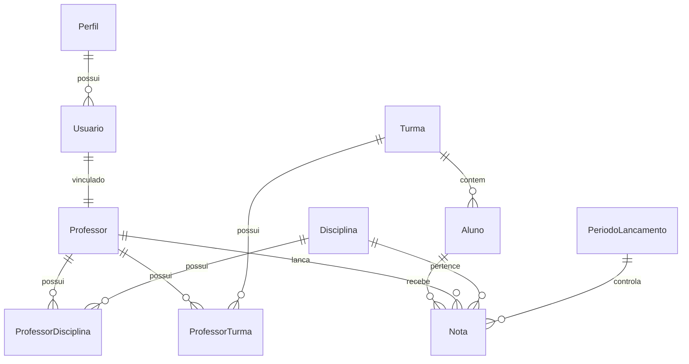

# Banco de Dados

## Objetivo

Definir a estrutura física e lógica do banco de dados do Sistema Escolar.

Este documento estabelece:

- Entidades
- Relacionamentos
- Índices
- Convenções
- Estratégias de auditoria
- Estratégias de exclusão
- Estratégias de crescimento

---

# Tecnologia

Banco de Dados:

SQLite

ORM:

Entity Framework Core

Mapeamento:

Fluent API

Migrations:

Entity Framework Core Migrations

---

# Convenções

## Nome das Tabelas

Utilizar singular.

Correto:

Aluno

Professor

Turma

Nota

Disciplina

Usuario

---

## Nome das Colunas

Utilizar PascalCase.

Exemplo:

Nome

DataNascimento

DataCriacao

UltimaAlteracao

---

## Chaves Primárias

Todas as tabelas devem possuir:

Id

Tipo:

Guid

ou

Long

A decisão inicial será:

Guid

---

# Entidade Base

Todas as entidades herdarão:

```csharp
EntityBase
{
    Guid Id;

    DateTime CreatedAt;

    DateTime UpdatedAt;

    string CreatedBy;

    string UpdatedBy;

    bool IsDeleted;
}
```

---

# Usuário

Tabela:

Usuario

## Campos

```text
Id
Nome
Email
Login
SenhaHash
PerfilId
Ativo
CreatedAt
UpdatedAt
CreatedBy
UpdatedBy
IsDeleted
```

## Índices

```text
Login (Único)

Email (Único)
```

---

# Perfil

Tabela:

Perfil

## Campos

```text
Id
Nome
Descricao
```

## Valores Iniciais

```text
Diretor

Professor
```

---

# Professor

Tabela:

Professor

## Campos

```text
Id
Nome
Email
Telefone
UsuarioId
Status
```

## Relacionamentos

```text
Professor → Usuario

1:1
```

---

# Aluno

Tabela:

Aluno

## Campos

```text
Id
Matricula
Nome
DataNascimento
TurmaId
Status
```

## Índices

```text
Matricula (Único)

Nome
```

## Relacionamentos

```text
Turma

1:N

Aluno
```

---

# Turma

Tabela:

Turma

## Campos

```text
Id
Nome
Serie
Turno
AnoLetivo
Status
```

## Índices

```text
AnoLetivo

Serie
```

---

# Disciplina

Tabela:

Disciplina

## Campos

```text
Id
Nome
Codigo
CargaHoraria
Status
```

## Índices

```text
Codigo (Único)
```

---

# ProfessorDisciplina

Tabela:

ProfessorDisciplina

## Objetivo

Relacionamento muitos para muitos.

## Campos

```text
Id

ProfessorId

DisciplinaId
```

## Relacionamento

```text
Professor

N:N

Disciplina
```

---

# ProfessorTurma

Tabela:

ProfessorTurma

## Objetivo

Relacionamento muitos para muitos.

## Campos

```text
Id

ProfessorId

TurmaId
```

---

# Período de Lançamento

Tabela:

PeriodoLancamento

## Campos

```text
Id

Descricao

AnoLetivo

DataInicial

DataFinal

Status
```

## Status

```text
Aberto

Fechado
```

## Regras

Não permitir:

- períodos sobrepostos
- datas inválidas

---

# Nota

Tabela:

Nota

## Campos

```text
Id

AlunoId

ProfessorId

DisciplinaId

PeriodoLancamentoId

Valor

Observacao

DataLancamento
```

## Regras

Valor mínimo:

0

Valor máximo:

10

Inicialmente configurável.

---

# Auditoria de Nota

Tabela:

AuditoriaNota

## Campos

```text
Id

NotaId

UsuarioId

ValorAnterior

ValorNovo

DataAlteracao

Observacao
```

## Objetivo

Registrar alterações de notas.

---

# Auditoria Genérica

Tabela:

AuditLog

## Campos

```text
Id

UsuarioId

Entidade

RegistroId

Operacao

ValoresAnteriores

ValoresNovos

DataEvento

IP
```

## Operações

```text
Insert

Update

Delete

Login

Logout

Import
```

---

# Relacionamentos

```text
Perfil

1:N

Usuario
```

```text
Usuario

1:1

Professor
```

```text
Turma

1:N

Aluno
```

```text
Professor

N:N

Disciplina
```

```text
Professor

N:N

Turma
```

```text
Aluno

1:N

Nota
```

```text
Disciplina

1:N

Nota
```

```text
Professor

1:N

Nota
```

```text
PeriodoLancamento

1:N

Nota
```

---

# Diagrama ERD (Mermaid)



---

# Estratégia de Exclusão

## Padrão

Soft Delete

Campo:

```text
IsDeleted
```

### Benefícios

- Recuperação de dados
- Auditoria
- Integridade histórica

---

# Estratégia de Auditoria

Implementação:

```text
EF Core Interceptors
```

Arquivos previstos:

```text
AuditInterceptor

AuditService

AuditRepository

AuditLog
```

---

# Estratégia de Paginação

Obrigatória para consultas.

Classe padrão:

```csharp
PagedResult<T>
```

Aplicar em:

- Alunos
- Professores
- Turmas
- Disciplinas
- Auditorias
- Relatórios

---

# Estratégia de Crescimento

O banco deverá suportar:

- Múltiplos anos letivos
- Crescimento contínuo de alunos
- Crescimento contínuo de notas
- Auditoria completa

---

# Checklist de Banco

☐ Todas as entidades possuem chave primária

☐ Todas as entidades possuem auditoria

☐ Índices criados

☐ Chaves estrangeiras definidas

☐ Soft Delete implementado

☐ Auditoria implementada

☐ Migrations controladas

☐ Diagrama atualizado

☐ Performance validada

☐ Integridade referencial garantida
